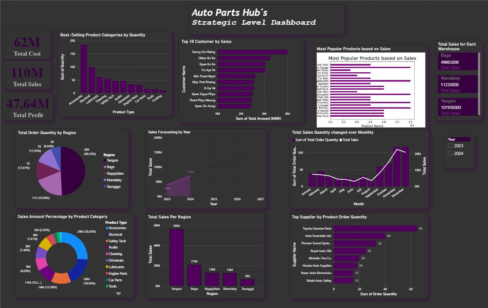
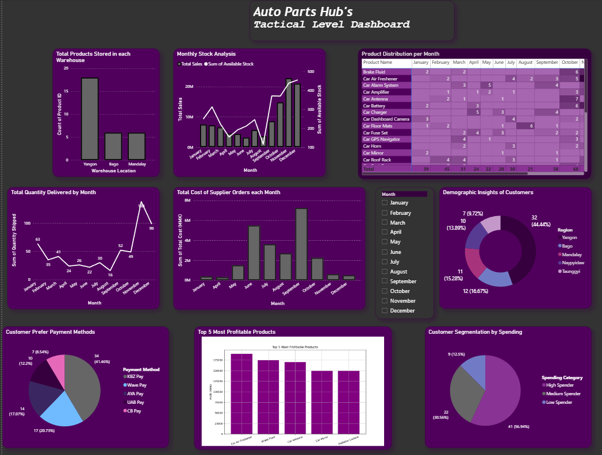
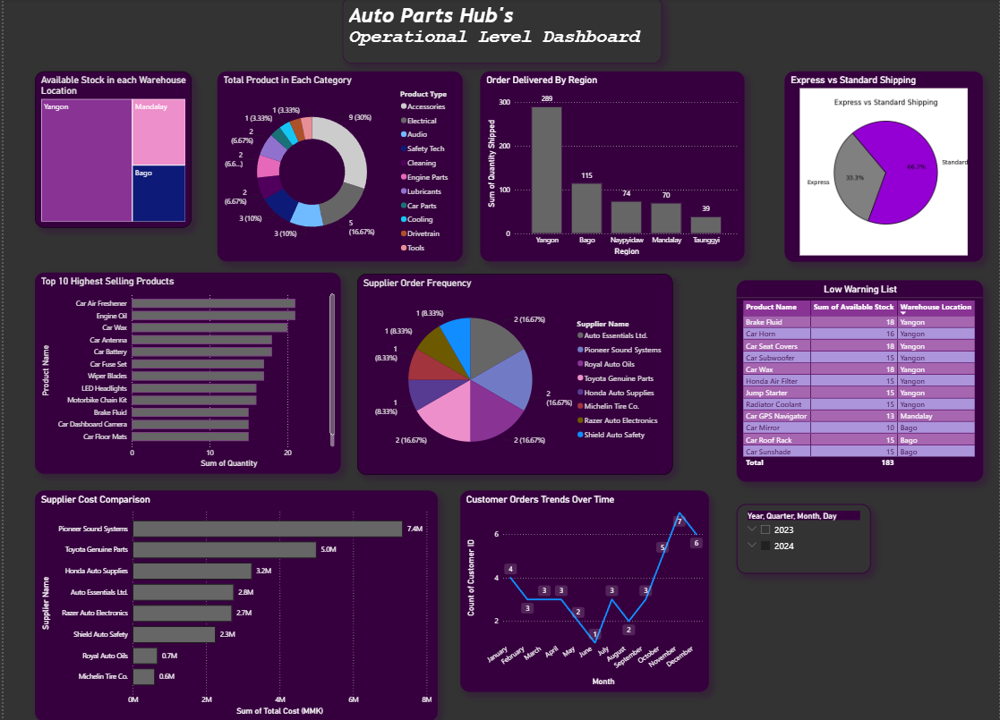

# 📊 AutoPartsHub Business Analytics Dashboard

## Project Overview

This project demonstrates the development of an interactive Business Analytics Dashboard for AutoPartsHub using Microsoft Power BI and Microsoft Excel.

The dashboard transforms raw business data into meaningful insights that support business decision-making at different management levels. It enables users to monitor key business performance indicators, analyze trends, and make informed decisions through interactive visualizations.

---

## Objectives

The objectives of this project are to:

- Analyze business performance using interactive dashboards.
- Monitor key performance indicators (KPIs).
- Support decision-making at different management levels.
- Present business data using clear and effective visualizations.

---

## Tools & Technologies

- Microsoft Power BI
- Microsoft Excel
- Power Query
- DAX

---

## Dashboard Structure

This project contains three dashboards designed for different levels of management.

### 📈 Strategic Dashboard

Designed for senior management to monitor overall business performance.

Features include:

- Executive KPIs
- Sales trends
- Regional performance
- Product performance
- Sales forecasting

---

### 📊 Tactical Dashboard

Designed for middle management to monitor departmental performance and support business planning.

Features include:

- Monthly stock analysis
- Product distribution
- Customer segmentation
- Payment methods
- Product profitability

---

### ⚙️ Operational Dashboard

Designed for daily business operations and operational monitoring.

Features include:

- Inventory monitoring
- Shipping analysis
- Supplier performance
- Low stock alerts
- Customer order trends

---

## Dashboard Preview

### Strategic Dashboard

*(Add screenshot here)*

---

### Tactical Dashboard

*(Add screenshot here)*

---

### Operational Dashboard

*(Add screenshot here)*

---

## Skills Demonstrated

- Business Analytics
- Data Visualization
- Dashboard Design
- KPI Development
- Power BI
- Power Query
- DAX
- Microsoft Excel
- Business Intelligence
- Analytical Thinking

---

## Repository Structure

AutoPartsHub-Business-Analytics
│
├── README.md
├── data
│   └── AutoPartsHub.xlsx
│
├── dashboard
│   ├── AutoPartsHub.pbix
│   ├── strategic-dashboard.png
│   ├── tactical-dashboard.png
│   └── operational-dashboard.png
│
└── docs
    ├── dashboard_guide.md
    └── data_dictionary.md

---

## How to Use

1. Download this repository.
2. Open the Power BI (.pbix) file using Microsoft Power BI Desktop.
3. Review the dashboard pages.
4. Explore the interactive filters and visualizations.

---

## Author

Min Thet Khaing

BSc (Hons) Computing Science Student

GitHub:
https://github.com/minnz-yock

LinkedIn:
https://www.linkedin.com/in/min-thet-khaing15